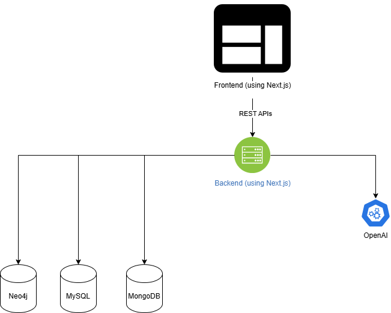

# Title
Academic World exploration by Mustafa Sadiq

# Purpose
Explore Academic World dataset. Be able to apply CRUD operations. Visualize and analyze.

# Demo
Give the link to your video demo. Read the video demo section below to understand what contents are expected in your demo.

# Installation

1. Set up MySQL, MongoDb and Neo4j databases following MP3 assignment instructions
2. Run all scripts in `initial-scripts/`
3. Update connection configs in `app/.env` file and add OpenAI key
4. install nodejs v20.11.1 +
5. cd to `/app`
6. `npm install`
7. `npm run dev`

# Usage

### Widget 1
### Widget 2
### Widget 3
### Widget 4
### Widget 5
### Widget 6
### Widget 7

# Design
This is a NextJS application for frontend and backend. The frontend interacts with backend using Rest APIs developed in NextJS /api/ routes. The backend interacts with MySQL, MongoDB and Neo4j databases. The backend also interacts with OpenAI for extra credit capabilities.

# Implementation
I used NextJS to implement both backend and frontend. The frontend is pure client side components which interact with backend using REST APIs.
Libraries that I used, installed using npm:

- bootstrap (for styling)
- dotenv (to manage environment variables)
- mongodb
- mysql2
- neo4j-driver
- next
- openai (for extra credit)
- react
- react-dom
- react-icons (for external link icon on photo_urls)
- react-select (for various dropdowns)

# Database Techniques
I have implemented the following database techniques:

### Prepared statements
I have used prepared statements i.e. ? and then passing in values as argument to query interface. This improves readibility and security, by separating out SQL statements from values, and preventing SQL Injections.

### Triggers
I have used a trigger `/initial-scripts/mysql.sql` to uppercase all University.name on insert.

### REST APIs
I have used REST APIs through which the frontend interacts with backend and which wraps the databases.

# Extra-Credit Capabilities
I have developed an extra credit capability. Given a faculty Id, I use OpenAI to extract information regarding the faculty memeber including

- A summary about them
- A summary related to their research
- A link to their portfolio or public page

# Contributions
I chose to work individually.

# Requirement tracking

- [X] R1: Code repo setup
- [X] R2: Report/Readme setup
- [ ] R3: Video demo recorded and uploaded
- [X] R4: Useful and beneficial insights
- [X] R5: Cool!
- [X] R6: MySQL used
- [X] R7: MongoDB used
- [X] R8: Neo4j used
- [X] R9: 6 widgets
- [X] R10: two widgets that manipulate database
- [X] R11: four widgets that take input from users
- [X] R12: visual layout using grids and bootstrap
- [X] R13: Prepared statement used 
- [X] R14: REST API used for accessing database
- [X] R15: Trigger used

